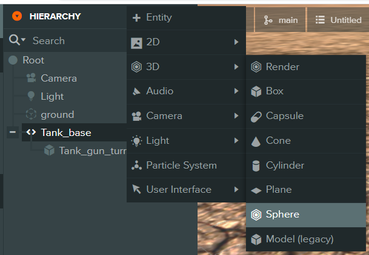
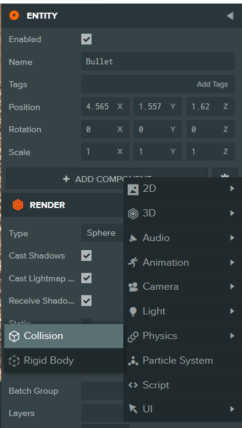
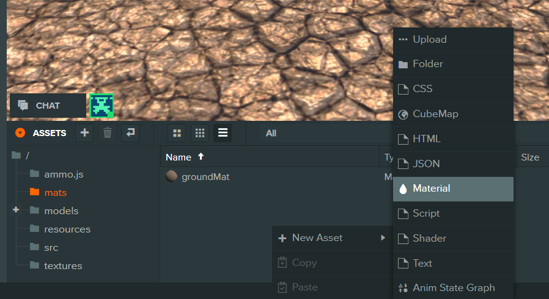
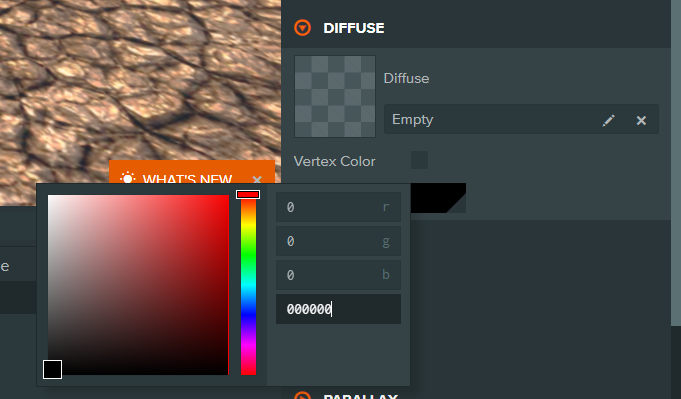
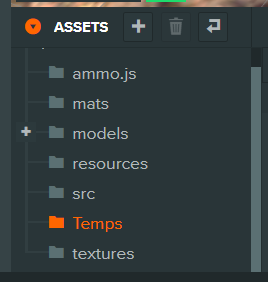
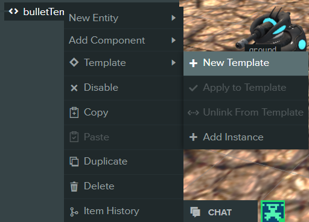
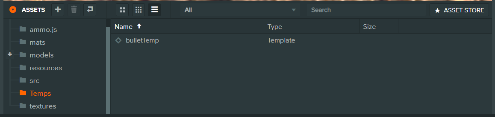
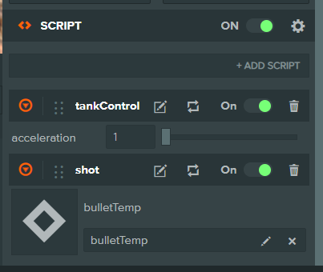

# <center>화이팅</center>

## 프로젝트 세팅
[ https://playcanvas.com/project/1128197/overview/tank3d_fork ] 
해당 링크에 들어가서 프로젝트 fork버튼 클릭
NAME 칸에 프로젝트 이름 작성한 후 우측 하단 FORK 버튼 클릭
복사 된 프로젝트 열기

## 스크립트 생성
src 폴더에 shot과 bullet 스크립트 생성
shot 스크립트 열기

## shot 스크립트
update 부분에 작성
```js
// wasPressed 는 lateUpdate에서 입력을 감지하는 함수
if(this.app.keyboard.wasPressed(pc.KEY_SPACE)) // 스페이스 키가 눌렸을 때
{
    this.shot(); // shot 호출
}
```
아래쪽에 shot 함수 정의 (테스트)
```js
Shot.prototype.shot = function() {
    // 여기다 발사하는 코드를 짤 거임
    console.log('shot!'); // 'shot!' 출력하기
}
```
tank에 shot 스크립트 추가하기
그 후 shot 함수가 작동하는지 플레이 해서 디버깅

## 총알 만들기

하이어라키의 \+ 버튼 -> 3D -> Sphere 추가



추가된 엔티티 이름을 'bulletTemp'으로 변경

ENTITY 탭 -> + Add Component -> Physics -> Collision 추가



Collision 컴포넌트의 타입을 sphere로 변경 후 엔티티의 크기를 0.5로 변경


Collision을 넣을 때와 동일한 방법으로 Rigidbody 추가

Collision과 Rigidbody를 추가했으면<br/>
mats 폴더에 bulletMat의 이름으로 머테리얼 추가



DIFFUSE탭에서 색상을 검은색으로 변경



만든 머테리얼을 드래그 앤 드롭하여 Bullet 엔티티에 적용

## bullet 스크립트
initialize 부분
```js
Bullet.prototype.initialize = function() {
    // findByName => 유니티의 GameObject.Find와 같은 함수
    var tank = this.app.root.findByName('Tank_base'); // root(최상의 부모)오브젝트에서 Tank_base로 된 오브젝트 찾아오기

    // js는 객체에 동적으로 변수를 생성하고 사용할 수 있음
    // lookatfor 라는 변수를 this 객체에 생성한 거임
    this.lookatfor = tank.lookAtFor; // tankControl 스크립트에서 추가된 lookAtFor라는 변수 받아오기

    var tankPosition = tank.getLocalPosition(); // tank의 로컬 좌표 받아오기

    this.entity.setLocalPosition(tankPosition.x, tankPosition.y + 0.5, tankPosition.z); // 받아온 좌표의 y에 0.5 만큼 더해서 현재 엔티티의 오브젝트 포지션에 세팅
};
```

update 부분
```js
Bullet.prototype.update = function(dt) {
    this.entity.translate(0, 0, 0.01); // z 축으로 매 프레임마다 0.01만큼 이동
};
```

Bullet 엔티티에 Add Component로 스크립트 컴포넌트를 추가
스크립트 컴포넌트에 bullet.js 스크립트 추가한 후 플레이해서 디버깅 하기
z축으로 쭉 이동할 거임

## 발사하기
shot.js 스크립트 열기

initialize 윗부분에 코드 추가
```js
// Shot 객체의 속성을 추가하는 함수
// '속성을 추가한다'는 유니티에서의 public 또는 [SerializeField] 하여 필드 추가하는 것과 같은 의미
Shot.attributes.add('bulletTemp', {type:'asset', assetType:'template'}); // type을 지정해서 'bulletTemp'라는 이름으로 속성 추가 
```

에디터로 돌아와 폴더에 Assets에 Temps폴더 추가



Temps 폴더를 연 후 bulletTemp 엔티티 클릭
bulletTemp 엔티티 우클릭 후에 Template -> New Template를 눌러 템플릿 생성
템플릿 == 프리팹





생성된 프리팹을 드래그 앤 드롭 하여 Tanke_base에 있는 shot 스크립트의 bulletTemp 칸에 추가



shot.js 스크립트 shot 부분 변경
```js
Shot.prototype.shot = function() {
    var instance = this.bulletTemp.resource.instantiate(); // bulletTemp 템플릿으로 총알 생성
    this.app.root.addChild(instance); // 생선 된 총알을 root에 넣기
}
```