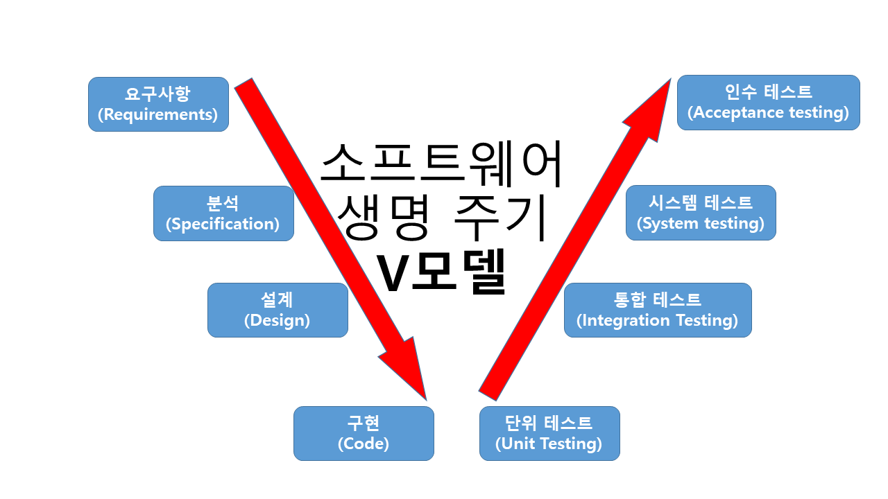

# 
 **정보처리기능사 실기** 

 

## **운영체제**  
#

> `운영체제의 목적`

 |목적|설명|
 |:-:|:-:|
 |처리 능력|일정 시간 내에 시스템이 처리하는 일의 양|
 |반환 시간|처리 완료까지 걸린 시간|
 |사용 가능도|즉시 사용 가능한 정도|
 |신뢰도|문제를 정확하게 해결하는 정도|
 

> `운영체제의 종류`

  |운영체제|특징|
  |:-:|:-:|
  |Windows|선점형 멀티태스킹 운영체제  GUI 사용|
  |UNIX|주로 서버에서 사용되는 시분할 시스템을 지원하는 운영체제  다중 사용자 멀티 태스킹의 운영체제|
  |LINUX|유닉스를 기반으로 만들어진 운영체제  오픈소스의 운영체제로 사용자가 소스코드에 자유로운 접근이 가능|
  |MS-DOS|문자 입력 인터페이스 CLI의 대표적인 운영체제|
 

> `운영체제 운용 기법 발당과정`

  |기법|설명|
  |:-:|:-:|
  |일괄 처리 시스템  (Batch Processing System)|일정 기간 또는 양의 데이터를 한번에 처리하는 방식|
  |다중 프로그래밍 시스템  (Multi-Programming System)|하나의 CPU와 주기억장치를 이용하여  여러개의 프로그램을 동시에 처리하는 방식|
  |시분할 시스템  (Time Sharing System)|여러 명의 사용자가 있는 시스템에서  사용자들의 프로그램을 번갈아 가면서 처리하는 방식|
  |다중 처리 시스템  (Multi-Processing System)|여러개의 CPU와 하나의 주기억장치를 이용하여  여러개의 프로그램을 동시에 처리하는 방식|
  |실시간 처리 시스템  (Real Time Processing System)|데이터 발생 또는 처리 요구가 있는 즉시 처리하는 방식|
  |범용 시스템  (General-Purpose System)|일괄 처리, 시분할, 다중 처리, 실시간 처리 시스템을 모두 제공하는 방식  다중 모드 처리 시스템이라고도 함|
  |분산 처리 시스템  (Distributed Processing System)|여러 개의 컴퓨터를 연결하여 하나의 작업을 처리하는 방식|
 

> `Windows 단축키`

 |키|기능|
 |:-:|:-:|
 |Windows key + A|알림 센터 실행|
 |Windows key + B|알림 영역으로 포커스를 옮김|
 |Windows key + Alt + D|화면에 날짜 및 시간을 표시 & 숨김|
 |Windows key + E|파일 탐색기 실행|
 |Windows key + F|피드백 허브 실행|
 |Windows key + I|설정 창 실행|
 |Windows key + K|연결 바로가기 표시|
 |Windows key + P|프로젝트 창 표시|
 |Windows key + Ctrl + Q|빠른 지원 실행|
 |Windows key + S|검색 상자 표시|
 |Windows key + T|작업 표시줄 앱 차례대로 선택|
 |Windows key + U|접근성 창 표시|
 |Windows key + X|바로 가기 메뉴 표시|
 |Windows key + ,|모든 창 투명화|
 |Windows key + Puase|시스템 창 표시|
 

> `UNIX 시스템 구성`
 
 |요소|특징|
 |:-:|:-:|
 |커널 (Kernel)|스케줄링, 기억장치 관리, 입•출력 관리 (암튼 중요한 놈)|
 |쉘 (Shell)|명령어 해석 후 커널에게 전달하는 인터프린터 (명령어 해석기)|
 

> `명령어`

 |기능|Windows & MS-DOS|UNIX & LINUX|
 |:-:|:-:|:-:|
 |디렉토리 위치 변경|cd|cd|
 |파일 목록 표시|dir|ls|
 |디렉토리 생성|md|mkdir|
 |파일 속성 변경|attirb|chmod|
 |파일 내용 표시|type|cat|
 |이름 변경|ren|mv|
 |파일 이동|move|mv|
 |파일 삭제|del|rm|
 |파일 복사|copy|cp|
 |파일 열기||open|
 |파일/디렉토리  소유권 변경||chown|
 |달력||cal|
 |파일 체크 & 수리||fsck|
 |파일 정령||sort|
 |현재 위치한  디렉토리 경로 출력||pwd|
  
 
> `기억장치 관리 전략`

 |전략|설명|
 |:-:|:-:|
 |반입 전략|보조기억장치의 데이터를  언제 주기억장치로 적재할 것인지 결정하는 전략|
 |배치 전략|새로 반입되는 데이터를  주기억장치 어디에 위치시킬 것인지 결정하는 전략|
 |교체 전략|주기억장치의 모든 영역이 이미 사용중인 상태에서  새로운 데이터를 배치하려 할 때 어느 영역과 교체할지 결정하는 전략|
  

> `스케줄링`

 |스케줄링|설명|
 |:-:|:-:|
 |선점 스케줄링|이미 실행중임에도 우선 순위가 높은 프로세스가  CPU를 강제로 빼앗아 사용할 수 있는 기법|
 |비선점 스케줄링|다른 프로세스가 CPU를 빼앗을 수 없는 기법|
 

## **데이터베이스**  
#

> `데이터베이스`
 - 특정 조직이 업무를 수행하는 데 필요한 데이터들의 모임
 

> `데이터베이스 설계`

 |순서|설명|
 |:-:|:-:|
 |요구 조건 분석|요구 조건 명세서 작성|
 |개념적 설계|개념 스키마, 트랜잭션 모델링, E-R 모델|
 |논리적 설계|논리 스키마 설계, 트랜잭션 인터페이스 설계|
 |물리적 설계|물리적 구조의 데이터로 변환|
 |구현|DDL로 데이터베이스 생성, 트랜잭션 생성|
 

> `스키마`
 - 데이터베이스를 구성하는 개체, 속성, 관계 등 구조에 대한 정의와 이에 대한 제약 조건들을 기술한 것

|스키마|설명|
|:-:|:-:|
|외부 스키마|사용자나 응용 프로그래머가 각 개인의 입장에서  필요로 하는 데이터베이스를 논리적 구조로 정의한 것|
|개념 스키마|데이터베이스의 전체적인 논리적 구조|
|내부 스키마|데이터베이스의 물리적 구조  데이터들의 실제 저장 방법을 기술한다|
 

> `데이터베이스 사용자`
 - 데이터베이스 관리자(DBA)
   - 데이터베이스 시스템을 관리하고 운영한다
 - 응용 프로그래머
   - 일반 사용자가 응용 프로그램을 사용할 수 있도록 인터페이스를 제공할 목적으로 데이터베이스에 접근한다
 - 일반 사용자
   - 데이터베이스에 있는 자우너을 활용할 목적으로 응용 프로그램을 사용하여 데이터베이스에 접근한다

> `DBMS`
 - 데이터베이스를 관리해 주는 소프트웨어
  
 |종류|특징|
 |:-:|:-:|
 |계층형 DBMS|트리구조, 부모 자식 관계, 일 대 다 관계만 존재|
 |계층형 DBMS|그래프를 이용한 구조, 1:1 1:N N:N 모든 관계 존재|
 |계층형 DBMS|2차원적인 표 구조, 테이블 내 속성의 관계를 설정하여 이용|
 

> `용어 설명`

 |용어|뜻|
 |:-:|:-:|
 |개체  (Entity)|데이터베이스에 표현하려는 것  개념, 정보 단위같은 대상체를 의미한다|
 |관계  (Relationship)|두 개 이상의 개체 간의 연관성  게체간의 관계 또는 속성간의 관계를 나타낸다|
 |튜플  (Tuple)|테이블에서의 행, 레코드라고도 불린다|
 |카디널리티  (Cardinality)|튜플의 수, 기수 대응수라고도 불린다|
 |속성  (Attribute)|테이블에서의 열, 데이터 항목 또는 필드의 값|
 |차수  (Degree)|속성의 수|
 |도메인  (Domain)|하나의 속성이 취할 수 있는 값의 범위|

> `키 (Key)`
 - 데이터 베이스에서 조건에 만족하는 튜플을 찾거나 순서대로 정렬할 때 기준이 되는 속성
 - 유일성
   - 하나의 키 값으로 하나의 튜플만을 검색할 수 있는 성질
 - 최소성
   - 키를 구성하는 속성들 중 꼭 필요한 최소한의 속성들로만 키를 구성하는 성질

 |키|조건|
 |:-:|:-:|
 |슈퍼키  (Super Key)|유일성은 만족하되 최소성은 만족하지 못한다|
 |후보키  (Candidate Key)|유일성과 최소성을 모두 만족한다|
 |기본키  (Primary Key)|후보키들 중 하나, NULL값을 가질 수 없다|
 |대체키  (Altermate Key)|기본키를 제외한 후보키들|
 |외래키  (Foreign Key)|다른 테이블의 기본키를 참조하는 속성|
 

> `무결성` 
 - 무결성
   - 데이터베이스의 값과 그것이 표현하는 현실 세계의 실제값이 일치하는 정확성
  
 |종류|특징|
 |:-:|:-:|
 |개체 무결성|테이블의 기본키를 구성하는 어떤 속성도  Null값이나 중복값을 가질 수 없다는 규정|
 |도메인 무결성|주어진 속성 값이  정의된 도메인에 속한 값이어여 한다는 규정|
 |참조 무결성|기본키와 참조키의 관계가 항상 유지되어야 한다는 규정|
 

> `기타 기능`

 |기능|설명|
 |:-:|:-:|
 |뷰  (View)|자료 조회 위한 가상 테이블|
 |인덱스  (Index)|데이터 검색 시간을 단축시키기 위한  보조적인 데이터 구조|
 |시스템 카탈로그  (System Catalog)|시스템 그 자체에 관련이 있는  객체에 관한 정보를 포함하는 시스템 데이터베이스  데이터 사전이라고도 한다|
 |트랜잭션  (Transaction)|데이터베이스에서의 작업 단위|
 

## **네트워크** 
#

> `IP class 구성`

 |Class|특징|
 |:-:|:-:|
 |A Class|기본 서브넷 마스크 : 225.0.0.0  0~127로 시작|
 |B Class|기본 서브넷 마스크 : 225.255.0.0  128~191으로 시작|
 |C Class|기본 서브넷 마스크 : 225.255.255.0  192~223으로 시작|
 |D Class|224~239로 시작|
 |E Class|실험적 주소|
 

> `IPv4 & IPv^`

 |구분|IPv4|IPv6|
 |:-:|:-:|:-:|
 |주소길이|32bit|128bit|
 |표시방법|8 bit 씩 4부분|16 bit 씩 8부분|
 |진법|10진수|16진수|
 |구분기호|옥텟( . )|콜론( : )|
 |전송방식|유니/멀티/브로드캐스트|유니/멀티/애니캐스트|
 

> `OSI 7계층`

  |계층명|주요장비|프로토콜|특징|
  |:-:|:-:|:-:|:-:|
  |응용 계층|게이트웨이|HTTP, FTP, DNS|사용자가 네트워크에 접근할 수 있도록 서비스 제공|
  |표현 계층|게이트웨이|SMTP|송신자 측에서 수신자 측에 맞는 형태로 데이터 변환|
  |세션 계층|게이트웨이|Telnet, DHCP, SSH|사용자 간의 연결을 유지 및 설정|
  |전송 계층|게이트웨이|TCP, UDP|신뢰성 있는 데이터 전송|
  |네트워크 계층|라우터|IP, ARP, RARP, ICMP, IGMP|IP주소를 이용하여 최적의 경로 선택|
  |데이터 링크 계층|브리지, 스위치|Ethernet|데이터를 신뢰성 있게 전송|
  |물리 계층|허브, 리피터||싱제 장비들을 연결하기 위한 특성을 정의|
 

> `네트워크 관련 장비`

 |장비|설명|
 |:-:|:-:|
 |허브|여러개의 장치를 하나로 연결|
 |리피터|감소된 신호 증폭|
 |브리지|소프트웨어적으로 데이터를 전송|
 |스위치|하드웨어적으로 데이터를 전송|
 |라우터|서로 다른 구조의 망을 연결|
 |게이트웨이|다른 종류의 네트워크를  상호 접속할 수 있도록 함|
 

> `프로토콜`

- 원활한 통신을 위한 통신 규약
- 기본 요소로 구문, 의미, 시간이 있음
 

 |프로토콜|설명|
 |:-:|:-:|
 |HTTP|웹 상에서 데이터를 주고받을 수 있는 프로토콜|
 |FTP|파일 교환을 위한 프로토콜|
 |Telnet|원격 통신 프로토콜, 보안성이 낮음|
 |SSH|원격 통신 프로토콜, 보안성이 높음|
 |TCP|신뢰성 높은 데이터 전송 프로토콜|
 |UDP|신뢰성 낮은 데이터 전송 프로토콜|
 |DHCP|클라이언트에게  IP주소를 자동적으로 제공해주는 프로토콜|
 |ARP|IP주소를 MAC주소로 변환해주는 프로토콜|
 

## **애플리케이션 테스트**
#

> `애플리케이션 테스트 7 원칙`

 |종류|설명|
 |:-:|:-:|
 |테스트는 결함의  존재를 밝히는 활동|테스트의 목적은 결함의 제거가 아닌  결함의 발견이다|
 |완벽한 테스트 불가능|모든 것에 대한 테스팅은  자원의 한계로 인해 불가능하다|
 |결함 집중  (파레토 법칙)|결함의 80%는 20%코드에 집중되어 있다|
 |살충제 패러독스|동일한 테스트 케이스에 의한 반복적 테스트로  새로운 버그를 찾지 못하는 내성 현상|
 |테스팅은 정황의 의존|테스트는 그 대상에 따라 다르게 수행되어야 한다|
 |오류-부재의 궤변|결함을 해결했다 하더라도  제 기능을 하지 못하면 테스트는 아무런 도움이 되지 않는다|

> `소프트웨어 생명 주기의 V-모델`

 

> `테스트 큰 분류`

 |분류|설명|테스트 방법|
 |:-:|:-:|:-:|
 |단위 테스트|코딩 직후 모듈 & 컴포넌트에  초점을 맞춘 테스트|화이트박스 & 블랙박스 테스트|
 |통합 테스트|단위 테스트 후  모듈을 결합하는 과정에서의 테스트|상향식 & 하향식 테스트|
 |시스템 테스트|소프트웨어가 해당 컴퓨터에서  수행되는지를 점검하는 테스트|기능적 & 비기능적 요구사항|
 |인수 테스트|사용자의 요구사항을  충족하는지에 초점을 맞춘 테스트|알파 & 베타 테스트|

> `프로그램 실행 여부에 따른 테스트 분류`

 |분류|설명|
 |:-:|:-:|
 |정적 테스트|프로그램을 실행시키지 않고  명세서나 소스코드를 대상으로 분석하는 테스트|
 |동적 테스트|프로그램을 실행하여 오류를 찾는 테스트|
 

> `테스트 기반에 따른 테스트 분류`
 
 |분류|설명|
 |:-:|:-:|
 |명세 기반 테스트|요구사항에 대한 테스트 케이스로 검사하는 테스트|
 |구조 기반 테스트|내부 논리 흐름에 따른 테스트 케이스로 검사하는 테스트|
 |경험 기반 테스트|테스터의 경험을 기반으로 하는 테스트|
 

> `시각에 따른 테스트 분류`

 |분류|설명|
 |:-:|:-:|
 |검증 테스트|개발자 시각에서 이루어지는  생산 과정에 대한 테스트|
 |확인 테스트|사용자 시각에서 이루어지는  생산 결과에 대한 테스트|
 

> `목적에 따른 테스트 분류`

 |분류|설명|
 |:-:|:-:|
 |회복 테스트|실패 유도 후 올바르게 복구되는지에 대한 테스트|
 |안전 테스트|불법적인 침입의 보호에 대한 테스트|
 |강도 테스트|과부하 시에도 정상적으로 실행되는지에 대한 테스트|
 |성능 테스트|효율성에 대한 테스트  (응답 시간, 처리량)|
 |구조 테스트|코드의 복잡도에 대한 테스트|
 |회귀 테스트|수정된 코드에 결함이 없는지 확인하는 테스트|
 |병행 테스트|변경 전과 후 두개의 소프트웨어에서  동일한 값을 입력하여 비교하는 테스트|
 

> `화이트박스 테스트`
 - 코드를 오픈시킨 상태에서 논리적인 경로를 확인하는 테스트

 |종류|설명|
 |:-:|:-:|
 |기초 경로 검사|코드의 실행 경로를 검사|
 |제어 구조 검사|**조건 검사** : 코드 내 논리적 조건을 검사  **루프 검사** : 반복문 검사  **데이터 흐름 검사** : 변수의 정의와 사용 위치 검사|
 

> `블랙박스 테스트`
 - 코드를 열지 않은 상태에서 기능을 확인하는 테스트

 |종류|설명|
 |:-:|:-:|
 |동치 분할 검사|입력에 따라 맞는 결과가 출력됐는지 확인하는 테스트|
 |경계값(한계값) 분석|중간값 보다 경계값에서 오류가 발생할 확률이 높다는 점을 이용하여  입력 조건의 경계값을 입력하여 확인하는 테스트|
 |원인 - 효과 그래프 검사|입력 값 간의 관계와 출력에 영향을 미치는 상황을 분석해  효용성 높은 테스트 케이스를 선정하여 검사하는 테스트|
 |오류 예측 검사|경험이나 감각으로 검사하는 테스트|
 |비교 검사|여러 버전들과 동일한 결과가 출력되는지에 대한 테스트|
 

> `테스트 프로세스`
 1. 테스트 계획
 2. 테스트 분석 및 디자인
 3. 테스트 케이스 및 시나리오 작성
 4. 테스트 수행
 5. 테스트 결과 평가 및 리포팅
 6. 결함 추적 및 관리
 

> `테스트 오라클`
 - 테스트 결과가 올바른지 판단하기 위해 사전에 정의된 참 값과 비교하는 활동

 |종류|설명|
 |:-:|:-:|
 |참 오라클|모든 입력값에 대한 기대값을 제공하는 오라클  다운되면 안되는 온라인 시스템에서 사용|
 |샘플링 오라클|몇몇의 입력값에 대한 기대값만을 제공하는 오라클| 
 |추정 오라클|몇몇의 입력값에 대한 기대값을 제공하고  나머지 입력값에 대해선 추정으로 처리하는 오라클|
 |일관성 검사 오라클|애플리케이션의 변경이 있을 때  케이스의 수행 전과 후의 결과값이 동일한지 확인하는 오라클|
 

> `테스트 하네스 도구`
 - 컴포넌트 및 모듈을 테스트하는 환경의 일부분  테스트를 지원하기 위해 생성된 코드와 데이터

 |종류|설명|
 |:-:|:-:|
 |테스트 드라이버|테스트 대상의 하위 모듈을 호출하고  파라미터 전달하고 모듈 테스트의 결과 도출함  상향식 테스트에서 사용|
 |테스트 스텁|모듈의 기능을 단순이 실행만 함  하향식 테스트에서 사용|
 |테스트 슈트|컴포넌트, 모듈, 테스트 케이스의 집합|
 |테스트 케이스|테스트할 케이스들|
 |테스트 스크립트|자동화된 테스트 실행 절차의 명세서|
 |목 오브젝트|사용자의 행위를 조건부로 입력해 실행시키는 객체  일종의 매크로|
 

## **SQL**
#
